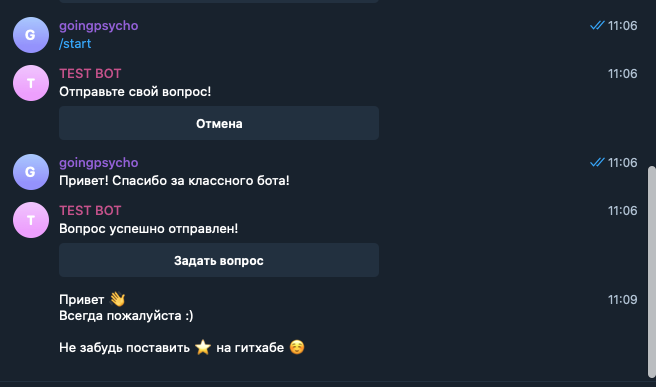
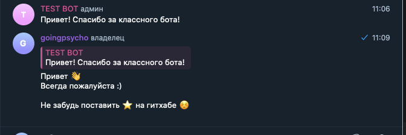
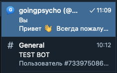

<h1>Feedback bot</h1>

<h1>Принцип работы</h1>

Сообщения от пользователей копируются методом copyMessage в топик чата админа (админов). Новый топик создается сразу, как пользователь отправил вопрос. Один пользователь не может создать более одного топика.

Как переписку видит пользователь:
  

В свою очередь, администратор видит так:  

 

 
